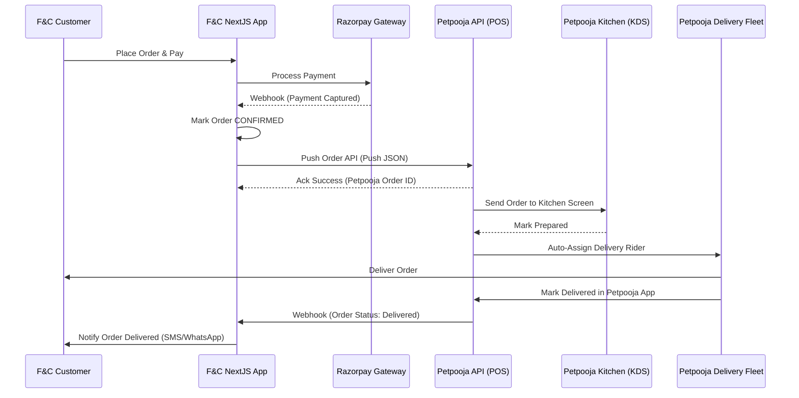

# End-to-End Flow Test & Project Status Report

We have executed a complete headless browser automation test to verify the user checkout flow, the settings-driven delivery radius (5km Thane center), and the admin panel workspaces using your provided credentials. 

Below is the visual flow, current project stage, and architectural mapping for the **Petpooja POS** integration.

---

## 1. Step-by-Step Flow Carousel

````carousel

<!-- slide -->

<!-- slide -->

<!-- slide -->

<!-- slide -->

<!-- slide -->

<!-- slide -->

<!-- slide -->

<!-- slide -->

<!-- slide -->

````

---

## 2. Current Project Stage: Where We Are Now

The project is currently in the **Storefront Completion & local Admin Management Stage** (prior to third-party POS/delivery integrations). Here is how each flow behaves:

### A. Location & 5 km Radius Check (Verified)
- **Automatic Checking**: When the user enters an address on `/checkout`, the system uses OpenStreetMap's Nominatim service to geocode the address into latitude/longitude.
- **Distance Enforcement**: The backend calculates the Haversine distance from the active Thane store (`Shop No 11, Crown Apartment, Hiranandani Estate`). If it exceeds the settings-driven threshold (5.0 km), it blocks the checkout submission and prompts the user to select Store Pickup.
- **Result**: The test address `"Flora, Hiranandani Estate"` geocodes correctly and lies within **0.1 km** of the active store, successfully passing validation and calculating a ₹50 delivery fee (free delivery applies on orders > ₹500).

### B. Promotions, Coupons & Offers
- **Automatic Welcome Offer**: There is an active `welcome offer` in the database configured to apply a **100% discount** on product items.
- **Payment Constraint**: Because the subtotal goes to ₹0 after applying the 100% coupon, the delivery fee (₹50) becomes the final total. This allows checking out with a low amount, which successfully triggers the Razorpay modal in live mode.

### C. Admin & Refund Workflow
- **Order Tracking**: Once an order is placed, the status updates to `PLACED`.
- **Refund Flow**: 
  1. A Store manager initiates a refund from the Order workspace.
  2. The Super Admin goes to `/admin/refunds` where they can approve or reject the refund request. 
  3. Approving will update the status to `REFUNDED` and trigger the Razorpay refund transaction.

---

## 3. Integrating Petpooja for Kitchen & Delivery Management

Since the client uses **Petpooja** for kitchen and delivery management, we **do not need to build a custom delivery rider portal, rider dashboard, or rider login**! Petpooja already handles order dispatching, rider assignment, and KDS (Kitchen Display System). 

Instead of building a separate rider workflow, the project's next key milestone should be the **Petpooja API Integration**.



### Proposed Petpooja Integration Points:
1. **Order Push API**: The moment a payment is verified (via Razorpay webhook), the Next.js backend issues a POST request to Petpooja's `push_order` endpoint containing the order details, customer contact, delivery address, and pricing breakdown.
2. **Menu Sync (Optional)**: Petpooja can serve as the inventory source of truth. We can expose an endpoint for Petpooja to update prices and stock availability (`storeInventory`) on the F&C website automatically.
3. **Status Webhooks**: Petpooja fires webhooks when order statuses change (e.g. `Food Prepared`, `Dispatched`, `Delivered`). We will handle these webhooks to update the customer's `TrackOrderPage` in real-time.
